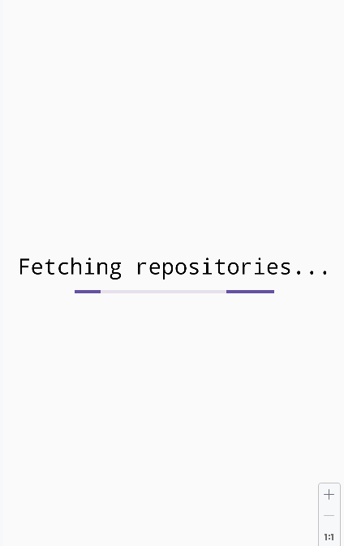

# Challenge

## How to make this run?

You need to set the next properties into your `local.properties` file:

- `ghBaseUrl`: This is the base URL of the Github API: `https://api.github.com/`
- `ghApiKey`: This is your personal token. You can get one from your account and
  it is required to perform unlimeted request to the API.

## Libraries

- All the UI and related is done using `Jetpack Compose`.
- `Retrofit`.
- `Gson` as converter.
- `MockK` used to mock in testing.
- `MockWebServer` to mock calls to the API in testing.
- `Turbine` to test flows.

## Project definitions

The architecture implemented is a MVVM with hexagonal layers.

The layer can only access to the others with less number:

1. Domain: `model/`.
2. Data: `repository/`, `datasource/`, `remote/`, `local/`.
3. DI: `di/`
4. UI: `ui/`

There is an exception for the `utils/` that can be shared between all the layers.

The app is pretty small. But in this case in order to "show" there is a bit more
of overarchitecture.

Basic states for the content: loading, success, error and empty.

For development and testing purposes a `fake` definition of
`RepoInformationRepository` is available, and was used to build almost all the app.

I know that I created a `DI` layer, buuut, I have to say that the current DI implemented
is the most basic of a DI. This implementation taken over use a third party lib is just
to not waste time in configurations and ~builds time (Hilt)~.

I found an edge case with the GH API with the `contributors` endpoint. If the repository
contains a lot of `contributors` you will get a message like: "Too much contributors to
return in this endpoint", so, in case of these repositories, the top contributor keeps in
loading state (yep, not error or empty, I noticed the error too late).
